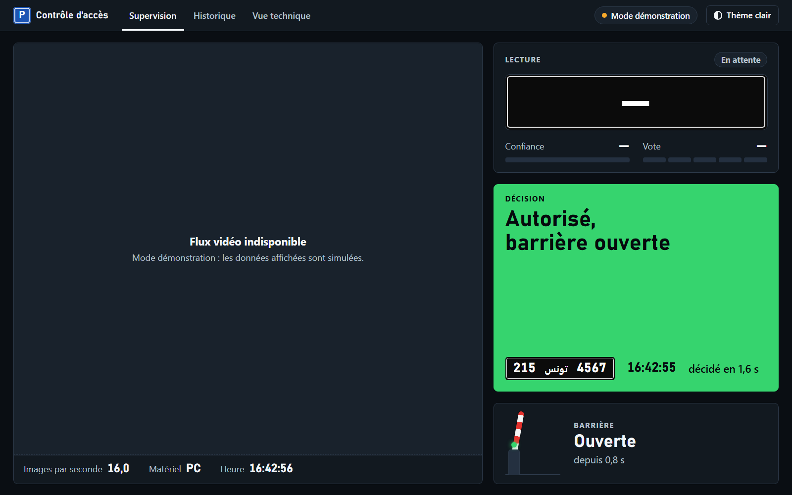

# Contrôle d'accès par lecture de plaques tunisiennes

Projet d'élève ingénieur (3e année Génie Électrique, option systèmes embarqués) : détecter et lire en temps
réel les plaques d'immatriculation tunisiennes à l'entrée d'un parking. La barrière s'ouvre si le véhicule
figure dans la liste des autorisés, et chaque passage est enregistré dans un journal.

Le système a été développé et validé sur PC (Windows, Python). Il est écrit pour être porté ensuite sur une
NVIDIA Jetson Nano 2 Go, mais ce portage n'est pas encore fait.



*Interface de supervision en mode démonstration. Sans caméra ni système, la page simule elle-même des
passages avec des numéros fictifs, d'où le « Flux vidéo indisponible ». Les valeurs affichées (5 voix
requises, images par seconde, latences) sont celles de la simulation, pas des mesures du système.*

## Format des plaques

De gauche à droite : la **série** (1 à 3 chiffres), le mot arabe « تونس » (Tunisie), puis le **numéro** (1 à
4 chiffres). Le système écrit une plaque `215 TU 4567`, dans l'ordre visuel. Les caractères sont blancs sur
fond noir, ou sur fond bleu pour les voitures de location. Tous les numéros cités dans ce dépôt sont fictifs.

## Pipeline

| # | Étape | Méthode |
|---|---|---|
| 1 | Source | webcam, vidéo ou dossier de photos |
| 2 | Détection de la plaque | **IA** : YOLOv8n (une classe), pré- et post-traitement écrits en NumPy (letterbox, décodage, NMS) |
| 3 | Redressement et binarisation | traitement classique (OpenCV) : coins de la plaque, homographie vers 450 × 100, CLAHE, seuillage adaptatif, morphologie |
| 4 | Segmentation des caractères | composantes connexes, filtres de taille et de forme, tri de gauche à droite, découpes 32 × 32 |
| 5 | Lecture | **IA** : petit CNN Keras (39 600 paramètres), 11 classes : chiffres 0 à 9 et « autre » (fragments du mot arabe, bruit, vis) |
| 6 | Validation et vote | séparation série / numéro, contrôle du format, seuil de confiance ; suivi des plaques d'une image à l'autre et vote sur plusieurs lectures |
| 7 | Action | liste des autorisés : barrière (simulée sur PC, servo prévu sur la Jetson) et journal des passages |

Aucun OCR tout fait n'est utilisé (ni Tesseract, ni EasyOCR…) : le traitement d'image est écrit explicitement
avec OpenCV et NumPy. Les deux modèles sont exportés en ONNX opset 12 : ONNX Runtime les exécute sur le PC,
TensorRT les exécutera sur la Jetson.

## Résultats obtenus

Les mesures portent sur le jeu public Kaggle « Tunisian Licensed Plates » (709 photos). Chaque étage n'a été
évalué qu'une seule fois sur la partie test, avec des réglages fixés d'avance.

| Étage | Mesure | Résultat |
|---|---|---|
| Détection (YOLOv8n, entrée 640) | plaques détectées sur le test (142 plaques), seuil 0,5 | **97,2 %** (138 sur 142) ; mAP50 0,984 |
| CNN de lecture | exactitude par caractère | **99,1 %** en validation croisée (5 plis, découpés par véhicule) ; 96,5 % sur le test |
| Lecture de bout en bout, une seule image | lectures correctes sur le test (142 plaques) | **43,0 %** ; 2,1 % de substitutions, 18,3 % de lectures plus courtes (un chiffre perdu), 36,6 % de rejets |
| Contrôle du redressement `complete` | lectures correctes au réglage (527 plaques, hors pli) | 65,5 % au lieu de 58,1 %, soit **+7,4 points** |
| Latence sur le CPU du PC (ONNX Runtime) | détecteur 640 ; CNN | 33 à 45 ms par image ; 0,12 ms par plaque (un seul appel en lot de 16) |

À lire avec ces précisions :
- **Les 43,0 % du test ont été mesurés avant le contrôle du redressement `complete`.** Son gain de
  +7,4 points n'a été mesuré qu'au réglage, il n'est pas confirmé sur des données vierges.
- Le test est fait à 61 % d'images web floues et compressées. Sur celles-ci, 36,8 % des plaques sont lues
  correctement, contre 52,7 % pour les images de plus de 700 px de large.
- Le CNN n'est pas le maillon faible. Les erreurs viennent surtout de la segmentation, qui perd des chiffres :
  très souvent un « 1 » au trait fin, soudé au cadre ou à une vis.
- En service, le système vote sur plusieurs images d'une même plaque avant de décider. Ce vote protège contre
  les lectures plus courtes, mais il n'a pas été mesuré sur des vidéos réelles (voir les limites).

Le détail de chaque mesure, de chaque décision et des règles fixées avant les mesures est dans le journal de
bord, [`docs/journal.md`](docs/journal.md).

## Limites

- **Pas d'évaluation du système complet sur des vidéos réelles.** Le taux d'ouverture correcte, les ouvertures
  à tort et les délais de décision ne sont pas mesurés.
  - Les réglages du vote ont été choisis par raisonnement : majorité sur 3 voix, fenêtre de 10 voix, attente
    maximale de 3 s. Le seuil du détecteur (0,5) et l'alerte « plaque sans voix » aussi.
  - Le protocole d'évaluation et ses outils sont prêts (`outils/evaluer.py`, `outils/mesures.py`) : 60 véhicules
    filmés, découpage développement / test par véhicule, listes d'autorisés croisées et adverses.
- **Plaques de location (fond bleu)** : vérifiées seulement sur un fond bleu simulé, aucune vraie photo.
- **Portage sur la Jetson non fait** : moteurs TensorRT, webcam USB et commande du servo restent à écrire. La
  barrière est simulée.
- **Sécurité de la barrière** : une vraie installation exige en plus un capteur de présence (boucle au sol). La
  caméra perd la plaque dès que la voiture s'engage sous la barrière.
- **Données** : les photos Kaggle ne viennent pas d'une caméra de parking, et le même véhicule y apparaît
  souvent sous plusieurs angles. C'est pourquoi tout ce qui apprend des chiffres est découpé par véhicule.

## Arborescence

| Dossier | Rôle |
|---|---|
| `systeme/` | code du système, sur PC et Jetson (Python 3.6, NumPy 1.19, OpenCV 4.1.1) |
| `outils/` | démo, interface web, vérifications, mesure de latence, évaluation (PC et Jetson) |
| `entrainement/` | préparation des données, entraînements, exports ONNX (PC uniquement, Python 3.11) |
| `interface/maquette/` | page de supervision (maquette conçue avec un outil de design, React 18 servi en local) |
| `config/` | modèle fictif de liste des autorisés |
| `docs/` | journal de bord, capture de l'interface |
| `donnees/`, `validation/`, `modeles/` | vides dans le dépôt : chaque README décrit le contenu attendu |

`systeme/` et `outils/` doivent tourner sur la Jetson (JetPack 4.6, Python 3.6) : la compatibilité se vérifie
avec `vermin '-t=3.6-' --violations --eval-annotations --feature union-types --feature fstring-self-doc --no-tips systeme outils`.

## Installation (PC Windows)

Prérequis : Python 3.11 et, pour les entraînements, une carte NVIDIA avec un pilote récent.

```powershell
py -3.11 -m venv .venv
.venv\Scripts\python.exe -m pip install --upgrade pip
# 1) PyTorch avec CUDA d'abord (sous Windows, PyPI ne fournit que la version CPU)
.venv\Scripts\python.exe -m pip install torch torchvision --index-url https://download.pytorch.org/whl/cu126
# 2) tout le reste
.venv\Scripts\python.exe -m pip install -r requirements-pc.txt
```

Versions exactes : `requirements-pc.lock.txt`. Les scripts se lancent depuis la racine du projet, comme des
modules (`python -m dossier.script`) : c'est ce qui rend le paquet `systeme` importable.

## Données et modèles : non inclus

Le dépôt ne contient ni photo, ni vidéo, ni modèle entraîné, ni donnée. Les photos montrent de vraies plaques,
et les modèles se régénèrent avec les scripts du dépôt. Les résultats obtenus seront proches de ceux du
tableau, sans être identiques : l'entraînement est aléatoire et la vérité terrain est saisie à la main.

**1. Détecteur** (`modeles/detecteur.onnx`)

Télécharger le jeu Kaggle « Tunisian Licensed Plates » dans `donnees/kaggle_brut/dataset/` : dossiers `train/`
et `test/`, images et annotations LabelImg `.xml`.

```powershell
python -m entrainement.inspecter_donnees        # inspection (images couchées, doublons)
python -m entrainement.preparer_yolo            # conversion au format YOLO (corrections_kaggle.csv appliquées)
python -m entrainement.entrainer_yolo --taille 320    # puis --taille 416 et --taille 640
python -m entrainement.evaluer_yolo             # choix de la taille, copie de modeles/detecteur.pt
python -m entrainement.exporter_yolo            # modeles/detecteur.onnx (opset 12) et variantes pour la Jetson
```

**2. CNN de lecture** (`modeles/lecteur.onnx`)

Il apprend sur les caractères découpés dans les plaques Kaggle. Leurs étiquettes viennent de la vérité
terrain, saisie à la main plaque par plaque.

```powershell
python -m entrainement.saisir_numeros           # vérité terrain -> donnees/verite/numeros.csv
python -m entrainement.extraire_caracteres      # jeu de caractères étiqueté, plis par véhicule
python -m entrainement.entrainer_cnn --entree gris --largeur 8           # validation croisée (5 plis)
python -m entrainement.entrainer_cnn --entree gris --largeur 8 --final   # modèle final
python -m entrainement.exporter_cnn gris_8      # modeles/lecteur_lot1.onnx et lecteur_lot16.onnx
copy modeles\lecteur_lot16.onnx modeles\lecteur.onnx    # le système utilise le lot de 16
```

**3. Liste des autorisés** : copier `config/autorises.exemple.csv` en `config/autorises.csv`, une colonne
`numero` au format `215 TU 4567`. Ce fichier n'est jamais versionné.

## Utilisation

```powershell
python -m outils.verifier_env                 # bibliothèques, GPU, webcam
python -m outils.verifier_logique             # suivi, vote, barrière : 71 contrôles sur scénarios synthétiques (sans modèle)
python -m outils.demo                         # système complet sur la webcam (q : quitter, espace : pause, s : capture)
python -m outils.demo --source <vidéo ou dossier de photos>
python -m outils.demo --sans-vote             # lecture image par image
python -m outils.demo --detection-seule       # détection seule
python -m outils.interface                    # interface web locale (http://127.0.0.1:5000), ouverte dans le navigateur
python -m outils.interface --source <vidéo ou photos> --boucle
```

L'interface web n'écoute que sur 127.0.0.1 (cette machine) et fonctionne sans internet. Elle montre la vidéo
annotée, la lecture et le vote en cours, la décision, la barrière, l'historique des passages et les étapes du
traitement.

**Voir la page sans modèle ni caméra** : sans le système, la page passe d'elle-même en mode démonstration
(numéros fictifs) au bout de 1,5 s. C'est ainsi qu'a été faite la capture ci-dessus.

```powershell
python -m http.server 8000 --bind 127.0.0.1 --directory interface/maquette
# puis ouvrir http://127.0.0.1:8000/Supervision%20parking.dc.html
```

## Jetson Nano

Cible : JetPack 4.6 (Ubuntu 18.04, Python 3.6, CUDA 10.2, TensorRT 8.2, OpenCV 4.1.1 fourni). Dépendances et
précautions : `requirements-jetson.txt`. Ni TensorFlow, ni PyTorch, ni ONNX Runtime sur la carte : les
fichiers `.onnx` y deviennent des moteurs TensorRT (`trtexec --fp16`). Ces moteurs ne sont pas portables : ils
se construisent sur la Jetson elle-même.

**Test anticipé sur Jetson** (avant le portage) :
1. Copier sur la carte les fichiers ONNX produits par les scripts d'export dans `sorties/verification/jetson/`.
   Activer le swap : la carte n'a que 2 Go de RAM.
2. Pour chaque fichier, lancer `/usr/src/tensorrt/bin/trtexec --onnx=<fichier> --fp16` :
   - `cnn_test.onnx` et `yolov8n_test.onnx`, de `entrainement/verifier_export_onnx.py` ;
   - `detecteur_320.onnx`, `detecteur_416.onnx` et `detecteur_640.onnx` ;
   - `lecteur_lot1.onnx` et `lecteur_lot16.onnx`.
3. Noter si la construction réussit ou le message d'erreur, et la latence moyenne de chaque fichier. Ces
   latences confirment ou non la taille d'entrée du détecteur et l'appel unique en lot de 16 pour le CNN.

Suite prévue : moteur TensorRT avec pycuda derrière la même interface que ONNX Runtime, webcam USB (V4L2),
commande du servo, et page ouverte depuis le navigateur d'un PC (jamais de navigateur sur la carte).
